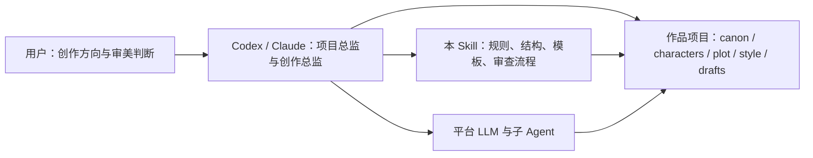

# Literary Engineering Project Skill

把长篇虚构创作当成一个可以持续维护的工程项目。

`literary-engineering-project-skill` 是一个面向 Codex、Claude 等工具层 Agent 的大型项目型 Skill。它不是一个单纯的“写小说提示词”，也不是一个只能聊天的创作助手，而是一套用于维护百万字级小说、剧本、伪记录文本、短剧和长视频提示词项目的工程化工作方法。

它的目标很直接：让 AI 不只是临时生成一段文本，而是能像维护软件项目一样，长期维护一个复杂文学项目的世界观、人物、剧情、文风、场景、审查记录和发布产物。

## 这个项目解决什么问题

当前很多 AI 文学创作工作流有几个常见痛点：

- 写得快，但长篇一致性容易崩。
- 人物一开始鲜明，写到后面逐渐同质化。
- 世界观、伏笔、人物状态和剧情因果缺乏工程化记录。
- 文风依赖一次性提示词，难以沉淀和复用。
- 审查、改稿、版本管理和发布流程不清晰。
- 多 Agent 协作时，谁负责决策、谁负责审查、哪些内容算正式 canon，边界容易混乱。

这个 Skill 的设计思路是：把作品项目拆成一组可读、可审查、可版本管理的文件资产，让 Codex / Claude 这类工具层 Agent 担任项目总监和创作总监，负责理解项目、维护文件、调用模型、组织子 Agent、生成候选内容并执行审查。

## 一句话理解

你给创作方向，工具层 Agent 负责项目管理；这个仓库负责告诉 Agent 如何把文学创作做成一个工程。



## 适合谁使用

这个项目适合：

- 想用 AI 长期开发小说、剧本、短剧或伪记录文学项目的人。
- 希望把创作项目做成可维护文件夹，而不是散落在聊天记录里的人。
- 想让 Codex、Claude 等 Agent 充当创作总监、编辑、设定维护者和审查者的人。
- 想研究工程化文学创作、AI 叙事系统、多 Agent 创作工作流的人。
- 想把作家文风学习结果沉淀成可挂载 Style Skill 的人。
- 想把已有小说、旧稿、剧本或伪记录材料整理成可续写、可改写项目的人。

它不适合：

- 只想“一句话立刻生成完整小说”且不关心后续维护的人。
- 只需要简单网文段落润色的人。
- 不希望项目文件、审查记录、候选资产被明确管理的人。

## 核心定位

这个仓库采用“项目型 Skill”架构：

- **Codex / Claude**：项目总监、创作总监、真实 LLM provider、子 Agent 编排者。
- **本仓库**：工程规范、文件结构、artifact contract、文风机制、模板、schema、可选 CLI 工具箱。
- **作品项目目录**：实际小说、剧本或文本项目的文件化状态。
- **本地 `director-chat`**：历史实现和回归工具，不是主入口。
- **FastAPI / LangGraph / Dify / 前端**：可选适配层，不是核心依赖。

也就是说，真正“思考”和“决策”的主体是你正在使用的工具层 Agent。本 Skill 负责给它一套清晰、可复用、可审查的工程操作系统。

## 能做什么

### 1. 作品项目维护

把一个虚构文学项目维护成文件结构：

- `canon/`：世界观、事实、规则、不可违背约束。
- `characters/`：人物档案、隐藏背景故事、目标、关系、状态演化。
- `plot/`：章节、场景、伏笔、时间线、分支选择。
- `style/`：文风 profile、Style Skill、挂载状态。
- `sources/`：已有文本、完整作品、旧稿、剧本和伪记录材料的导入与反推任务。
- `scenes/`：场景定义、目标、参与人物和约束。
- `drafts/`：正文草稿、候选文本、晋升记录。
- `reviews/`：审查报告、风险、阻塞项、修改建议。
- `workflow/`：运行记录、审批记录、发布状态。

### 2. 创作总监式工作流

当用户只给一个方向，例如：

> 写一个双主角悬疑长篇，背景是近未来县城治理系统，气质克制、压抑、有伪记录感。

Agent 应该能够：

1. 理解作品方向。
2. 建立或更新项目 brief。
3. 生成候选世界观、人物、关系和主线大纲。
4. 审查这些候选内容是否互相冲突。
5. 询问用户少量高价值创作问题。
6. 把确认后的内容晋升为正式项目资产。
7. 持续推进场景、章节、审查和发布。

用户不需要直接面对复杂 schema、内部工具参数或目录细节，除非用户明确要求。

### 3. 文风学习与 Style Skill

本项目支持“作家作为文风项目，作品作为子项目”的思路：

- 输入公版或授权文本语料。
- 编译文风 profile。
- 生成供 LLM 使用的文风约束提示词。
- 通过回译、扩写或盲评方式评估提示词有效性。
- 打包为可挂载 Style Skill。
- 在创作项目中将文风作为表达层最高优先级。

文风约束影响：

- 叙述距离
- 句法节奏
- 意象系统
- 对话密度
- 心理描写方式
- 感官比例
- 场景推进方式

但文风不能覆盖 canon、人物事实、剧情因果、法律/安全边界或用户明确约束。

### 4. 候选资产与审查

新人物、新设定、新关系、新剧情分支、新状态变化，默认都应该先进入候选区，而不是直接成为正式设定。

典型流程：

1. 生成候选内容。
2. 记录来源、意图、假设和风险。
3. 执行人物逻辑、世界观、剧情功能、文风或 canon 审查。
4. 等待用户确认。
5. 晋升为正式资产。

这样做可以避免长篇项目中最常见的问题：AI 写着写着把临时灵感当成正式设定。

### 5. 角色隐藏背景故事

人物文件可以维护 `background_story`。

它不是给正文直接展示的“人物小传”，而是隐藏行为因果：

- 为什么角色会回避某类选择。
- 为什么一句普通对话会触发过度反应。
- 为什么角色在关键时刻误判他人。
- 为什么角色会说谎、沉默、转移话题或做出不经济选择。

这能帮助人物行为更稳定，也能让剧情发展更有内在压力。

### 6. 已有作品反推与续写基底

如果你已经有一段旧稿、完整小说、剧本、伪记录材料或大量碎片笔记，可以先把它导入项目：

```powershell
$env:PYTHONPATH = "src"
python -m literary_engineering_workbench protocol source-ingest
python -m literary_engineering_workbench source-ingest "<work-dir>" --source "<source-file-or-dir>" --title "源作品" --work-id source-work
```

导入后，CLI 会生成源文本 raw、chunks、manifest、导入报告和平台 Agent 任务侧车。随后 Codex / Claude 读取任务侧车，反推出：

- 项目简报候选
- 人物、关系、隐藏背景故事候选
- 世界观、地点、组织与限制候选
- 大纲、时间线、伏笔和未解问题候选
- 可转化为 Style Skill 的文风说明候选
- 证据强度与晋升风险审查

这些内容默认全部是候选，必须带证据引用和置信度；未经审查与用户批准，不会覆盖正式 canon、人物文件、剧情文件或文风挂载。

## 快速开始

### 方式 A：作为 Codex Skill 安装

把仓库复制到 Codex skills 目录：

```powershell
git clone https://github.com/o-1717986918/literary-engineering-project-skill.git `
  C:\Users\<你的用户名>\.codex\skills\literary-engineering-project-skill
```

重新打开 Codex 后，当你提出长篇文学工程、文风学习、剧情维护、人物设定、场景审查等请求时，Codex 就可以加载这个 Skill。

### 方式 B：作为项目参考仓库使用

你也可以把它当成一个公开项目模板或研究仓库：

```powershell
git clone https://github.com/o-1717986918/literary-engineering-project-skill.git
cd literary-engineering-project-skill
```

然后让 Codex / Claude 读取：

1. `SKILL.md`
2. `AGENTS.md`
3. `CLAUDE.md`
4. `agentread.yaml`
5. `references/project-director-playbook.md`

### 方式 C：使用可选 CLI 工具箱

开发仓库使用 `src/`：

```powershell
$env:PYTHONPATH = "src"
python -m literary_engineering_workbench --help
```

安装型 Skill 包使用 `scripts/`：

```powershell
$env:PYTHONPATH = "scripts"
python -m literary_engineering_workbench --help
```

运行测试：

```powershell
$env:PYTHONPATH = "src"
python -m unittest discover -s tests -v
```

CLI 是可选工具箱，不是必须入口。正常使用时，推荐让 Codex / Claude 直接担任创作总监并维护项目文件。

## 给 Agent 的推荐入口

如果你在 Codex 或 Claude 中使用这个项目，可以这样说：

> 使用 `literary-engineering-project-skill`，帮我把一个长篇小说项目作为工程维护。我只提供创作方向，你负责项目总监、创作总监、候选资产生成、审查和文件维护。

或者：

> 读取这个仓库的 `SKILL.md`、`AGENTS.md`、`agentread.yaml` 和 `references/project-director-playbook.md`，然后帮我初始化一个长篇伪记录小说项目。

或者：

> 我想学习一个公版作家的文风，把语料整理成文风项目，输出可挂载到创作流程中的 Style Skill。

## 典型工作流

### 新建作品项目

1. 用户给一句或一段创作方向。
2. Agent 建立项目 brief。
3. Agent 创建项目目录和初始结构。
4. Agent 生成候选人物、世界观、主线和风格方向。
5. Agent 审查候选内容并询问用户关键选择。
6. 用户批准后，候选内容晋升为正式项目资产。

### 推进一个场景

1. 读取场景目标、参与人物、相关 canon、剧情上下文和已挂载文风。
2. 生成上下文包。
3. 模拟人物在当前压力下的合理行为。
4. 给出多个剧情分支。
5. 选择或推荐最佳分支。
6. 生成场景编排包。
7. 写出候选正文。
8. 执行 canon、人物、剧情功能和文风审查。
9. 提出人物状态变化 patch。

### 学习并挂载文风

1. 建立作家文风项目。
2. 导入作品文本。
3. 编译文风 profile。
4. 生成 LLM-facing 风格提示词。
5. 评估提示词有效性。
6. 打包 Style Skill。
7. 挂载到创作项目。
8. 后续正文创作优先遵守该文风约束。

## 目录说明

```text
literary-engineering-project-skill/
├── SKILL.md                         # Codex Skill 主入口
├── AGENTS.md                        # 通用工具层 Agent 使用说明
├── CLAUDE.md                        # Claude 使用入口
├── agentread.yaml                   # Agent 路由表：不同任务该读哪些文件
├── references/
│   ├── project-director-playbook.md # 项目总监行为手册
│   ├── artifact-contracts.md        # 产物、候选、审查和晋升规则
│   ├── workflows.md                 # 可选 CLI 工作流
│   └── orchestration.md             # LangGraph / Dify / 外部编排说明
├── docs/                            # 架构、模块和历史实现文档
├── templates/                       # 作品项目模板和提示词模板
├── schemas/                         # JSON schema 与结构约束
├── src/                             # 开发仓库中的可选 Python 工具箱
├── frontend/                        # 历史本地前端，可选
└── tests/                           # 回归测试
```

## 重要原则

1. **项目状态是源代码，文本是产物。**  
   作品项目应该能被版本管理、审查和回滚。

2. **平台 Agent 是真正的总监。**  
   Codex / Claude 负责理解用户意图、拆解任务、组织子 Agent 和维护文件。

3. **候选不等于 canon。**  
   模型输出、检索结果、角色模拟和剧情分支都只是证据或候选。

4. **审查是正式合并边界。**  
   人物、世界观、剧情和正文都应该经过审查再晋升。

5. **文风优先，但不凌驾事实。**  
   Style Skill 是表达层最高优先级，不覆盖 canon、人物事实和用户硬约束。

6. **角色背景故事是隐藏因果。**  
   它影响行为，不应该被粗暴地直接塞进正文说明。

7. **不要把密钥放进项目。**  
   API key、provider secret 和账号凭据应放在平台密钥管理、环境变量或本地全局配置中。

## 和原始 Workbench 的关系

本仓库来自原始项目 [`literary-engineering-workbench`](https://github.com/o-1717986918/literary-engineering-workbench) 的路线转换。

原始 Workbench 曾经尝试在本地实现完整创作总监、前端、API、LangGraph、Dify、provider 和 agent loop。这个仓库保留了其中可复用的结构、文档、模板、schema 和可选工具箱，但主路线已经改变：

> 不再强行在本地重造一个完整创作平台，而是让 Codex / Claude 等工具层平台承担总监和模型编排能力。

这使项目更适合作为通用 Skill、项目规范和 Agent 操作手册。

## 安全与版权边界

- 推荐使用公版、授权或用户自有语料进行文风学习。
- 对仍受版权保护的当代作者，建议抽象学习高层写作技法，而不是追求可混淆的逐字复刻。
- 不把 API key 或账号密钥写入仓库。
- 不把模型输出直接当成事实、法律意见、医学建议或现实人物信息。
- 公开发布前应检查语料来源、引用边界和生成内容风险。

## 当前状态

- Skill 入口：已完成。
- Codex / Claude 项目型使用路线：已完成。
- 文风学习与 Style Skill 机制：已保留并纳入项目型架构。
- 已有作品反推与源文本导入：已完成 `source-ingest` / `extract-existing-work`。
- 可选 CLI 工具箱：可运行。
- 原本地创作总监、FastAPI、LangGraph、Dify、前端：保留为可选历史工具和集成示例。

## 推荐下一步

如果你第一次使用，可以从这三个任务之一开始：

1. 让 Agent 初始化一个新的长篇作品项目。
2. 让 Agent 把已有小说/剧本项目整理成工程目录。
3. 让 Agent 建立一个作家文风项目并输出可挂载 Style Skill。

这个项目最有价值的使用方式不是“让 AI 一次性写完”，而是让 AI 和你一起长期维护一部作品的生命线。
