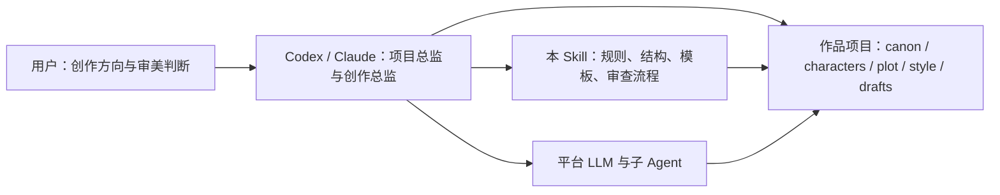

# 长篇文学写作工程 Skill

`literary-engineering-project-skill`

把 AI 关进程序里：让 Codex / Claude 像维护代码库一样，长期维护一部小说、剧本或伪记录文学项目。

这不是一个“万能写小说提示词”，也不是一个把前端、模型、Agent loop 全部塞进本地的创作平台。它是一套面向工具层 Agent 的大型项目型 Skill：把世界观、人物、剧情、文风、场景、审查、字数预算和发布产物拆成可读、可审查、可版本管理的工程资产，让平台 Agent 负责真实创作、判断、推演和维护。

- 当前版本：`0.84.3`
- 核心形态：Codex / Claude / 类似工具层 Agent 的长篇文学工程操作系统
- 适用对象：小说、剧本、伪记录文本、短剧、长视频提示词、长篇世界观项目

## 一句话理解

用户提供创作方向和审美判断；平台 Agent 担任项目总监、创作总监和审查者；本仓库提供规则、文件契约、提示词结构、流程门禁和正式路线 CLI 工具箱。



## 这个项目解决什么问题

当前 AI 文学创作最常见的问题不是“不会写”，而是“写出来以后不可维护”：

- 写得快，但长篇一致性容易崩。
- 人物一开始鲜明，写到后面逐渐同质化。
- 世界观、伏笔、人物状态和剧情因果缺乏工程化记录。
- 文风依赖一次性提示词，难以沉淀、复用和挂载。
- 字数规划失真，目标 50 万字，实际剧情库存只够几万字。
- 场景推演、分支选择、审查、改稿、晋升和导出容易漏步骤。
- 输出正文混入 scene 编号、canon 注释、workflow 痕迹和内部提示词。
- AI 腔明显：抽象总结过多、转折句模板化、标点节奏混乱、表达越来越像同一个模型。
- 多 Agent 协作时，谁负责决策、谁负责审查、哪些内容算正式 canon，边界容易混乱。

这个 Skill 的答案是：把作品项目拆成一组明确的文件资产和流程门禁。AI 可以自由创作，但每一次创作都要落到候选、审查、修订、晋升、发布这些可追踪步骤里；模型输出不会因为“看起来不错”就自动变成正式设定或最终正文。

## 适合谁使用

这个项目适合：

- 想用 AI 长期开发小说、剧本、短剧或伪记录文学项目的人。
- 希望把创作项目做成可维护文件夹，而不是散落在聊天记录里的人。
- 想让 Codex、Claude 等 Agent 充当创作总监、编辑、设定维护者和审查者的人。
- 想研究工程化文学创作、AI 叙事系统、多 Agent 创作工作流的人。
- 想把作家文风学习结果沉淀成可挂载 Style Skill 的人。
- 想把已有小说、旧稿、剧本或伪记录材料整理成可续写、可改写项目的人。
- 想让 10 万字、50 万字、百万字、多卷目标真正落到卷章场景和剧情库存的人。

它不适合：

- 只想“一句话立刻生成完整小说”且不关心后续维护的人。
- 只需要简单网文段落润色的人。
- 不希望项目文件、审查记录、候选资产被明确管理的人。

## 核心定位

这个仓库采用“项目型 Skill”架构：

- **Codex / Claude**：项目总监、创作总监、真实 LLM provider、子 Agent 编排者。
- **本仓库**：工程规范、文件结构、artifact contract、文风机制、模板、schema、正式路线 CLI 工具箱。
- **作品项目目录**：实际小说、剧本或文本项目的文件化状态。
- **本地 `director-chat`**：历史实现和回归工具，不是主入口。
- **FastAPI / LangGraph / Dify / 前端**：可选适配层，不是核心依赖。

也就是说，真正“思考”和“决策”的主体是你正在使用的工具层 Agent。本 Skill 负责给它一套清晰、可复用、可审查的工程操作系统。

## 架构亮点

### 1. 把 AI 关在程序里

这个项目允许 AI 做自由创作，但不允许自由漂移。平台 Agent 可以写人物、造世界、推演剧情、生成 JSON、修订正文、选择分支，但所有结果都必须进入明确的工程位置：候选资产、上下文包、分支 manifest、审查报告、修订候选、晋升记录或导出包。

换句话说，AI 负责想象力，工程结构负责边界。模型输出默认只是 candidate，不是 canon；角色模拟只是证据，不是剧情决定；审查通过之前，正文不能直接变成最终作品。

### 2. 平台 Agent 是真实创作引擎

本仓库不把本地 dry-run、HTTP provider 或实验性 `director-chat` 当成正式创作入口。正式路线要求 Codex / Claude 这类工具层平台承担 LLM、子 Agent、推理、自由决策和用户对话，Skill 只提供操作手册、artifact contract、schema、模板和确定性 helper。

这让项目更像一个“文学工程协议”：任何足够强的工具层 Agent 都可以加载它，然后按同一套文件契约维护作品。

### 3. 场景链路有强门禁

正式场景开发不是直接写正文，而是：

```text
context packet
-> roleplay simulation
-> branch simulation
-> formal branch_selection.md
-> scene composition
-> prompt manifest
-> draft candidate
-> platform Agent scene review
-> revise-scene when needed
-> promote-candidate
-> state patch / export
```

`route-audit` 会检查场景是否漏掉角色扮演推演、分支模拟、正式分支选择、文风审查、候选专属审查和晋升门禁。`promote-candidate` 也要求候选正文必须有对应的、干净通过的 AgentReview，避免“写完就合并”。

`v0.73.0` 起，章节 ready 和正式导出也使用同一组强门禁：上下文包、RP 读取回执、分支 manifest、正式 `branch_selection.md`、ready composition、静态 review clean `pass`、平台 AgentReview clean `pass` 且引用当前草稿。`pass_with_notes`、warnings、revision_actions、style_notes 或文风偏差会进入 `needs_revision`，不能直接导出。

`v0.75.0` 起，反 AI 腔规则升级为“核心禁区 + 密度门禁”：机械“不是……而是……”和“不是……——是……”等生硬对照变体不再被判断为合理修辞，文风学习只能提取其背后的纠偏、讽刺、信息反转或节奏功能，不能把模板句式授权给生成模型。器官轮岗、万能占位、比喻依赖、抽象总结、景物强制同步、模板转折和金句化收束按约 2% 叙事单元密度控制，孤立风险点进入复核，密集出现必须修订。语义级修订仍必须由平台 Agent 逐句判断，避免脚本把否定关系改坏。

`v0.76.0` 起，Supervisor Agent 执行纪律被写成硬规则：遇到文档中的 CLI 或 agent sidecar 步骤，必须先 `--help`、`protocol <route>` 或尝试最小安全命令，不能事前判断“我做不了”。`agent-review-scene` 明确为 sidecar 生成器：命令生成任务文件后，当前平台 Agent 必须读取任务并写入 `scene_review.v1` JSON/Markdown；`export-package` 等官方门禁若阻塞，不能用自写脚本绕过并称为最终交付，只能修 gate 或标记为内部预览。

`v0.77.0` 起，批量场景开发增加“逐场景账本”硬门禁：一条完整 scene loop 只覆盖一个场景，不能用做过 `scene_0075` 来代表 `scene_0076-0099`。`route-audit --route scene-development` 会逐个场景检查 context、RP、branch、composition、prose candidate、exact-candidate AgentReview、promotion、promoted draft 和 state patch；10 万字以上项目还会在场景开发/导出前检查 word-budget 是否完成。

`v0.78.0` 起，正式 Skill 宿主禁用调试/跳审参数：`--allow-unreviewed`、`--allow-review-notes`、`--include-blocked`、`--allow-unapproved` 等只保留给维护者回归测试，不能作为项目运行指令。`route-audit` 会扫描 manifest 中的 debug waiver 字段并阻塞正式路线。同时，正文创作权收束到主平台 Agent：subagent 只能做资料摘要、连续性表、schema/标点/风险检查等机械支持，不得代写、改写、扩写或最终化正文。

`v0.79.0` 起，平台 Agent 场景审查会自动注入确定性 `Style Lint (auto-detected)` 证据：在审查 Agent 做文学判断前，先由 `anti_ai_style.py` 抓取“不是 A——是 B”等机械对照变体、破折号/模板句式/AI 腔风险，再要求审查 JSON 和 Markdown 明确处理这些证据。这样审查不再只依赖同一个 LLM 的语义直觉，也避免用正则脚本直接改坏正文。

`v0.80.0` 起，Style Lint 从审查证据升级为分级机器门禁：`mechanical-contrast-frame` 和所有 medium+ AI 腔风险会阻塞 `promote-candidate`、`route-audit` 和 chapter/export readiness；low 风险不阻塞，但必须进入 AgentReview notes 或保留理由。也就是说，即使审查 JSON 被写成 `pass`，候选正文仍会被确定性 lint 重新检查。

`v0.81.0` 起，修订进入反规避协议：不能把“不是……而是……”换成“并不是……只是……”“看似……其实……”“表面上……实则……”等同功能转折。`generate-scene` 写出的 `.agent_tasks.md` 会要求主平台 Agent 先执行 prompt manifest 中的 `generation_standards.anti_evasion`；`revise-scene` 会把 Style Lint 证据和反规避负担证明表写入修订任务；`route-audit` 会显式检查静态 `review-scene` clean pass，并在修订候选参与链路时要求反规避 manifest clean。

`v0.82.0` 起，正式路线 CLI 不再被描述为“可选步骤”。探索性讨论可以不用 CLI，但正式 `scene-development` 必须保留 CLI provenance：`simulate-scene --agent`、`branch-simulate --agent`、`compose-scene --agent-tasks`、`generate-scene` prompt manifest、生成 `.agent_tasks.md` 和平台 Agent candidate manifest。`promote-candidate` 与 `route-audit` 会阻塞缺少 prompt/task/manifest provenance 或把手写文件冒充正式产物的候选。

`v0.83.0` 起，平台 Agent 任务侧车升级为显式完成标记和持续状态机：任何 `.agent_tasks.md` 都需要相邻 `.agent_completion.json` 才算完成，`branch-simulate --agent` 会检查 RP sidecar，`compose-scene --agent-tasks` 会检查 branch sidecar，`generate-scene` 会检查 RP、branch、composition sidecar。`run-workflow --agent-tasks` 写出 sidecar 后会停在 handoff，等待平台 Agent 读取、执行、写完成标记后再继续。长篇字数预算也进入标准写作链路：`scene.yaml` 可写 `word_count_target/min/max`，context packet、composition、prompt manifest、generation `.agent_tasks.md`、AgentReview、promotion、route-audit、chapter/export readiness 都读取清洗正文的字数预算门禁，不再只把 `word_budget.json` 当旁路文件。

`v0.84.0` 起，正式 `scene-development` 进入 CLI-mediated Agent Workflow Kernel 第一版：平台 Agent 不再凭记忆决定下一步，而是通过 `task-next` 获取下一项正式任务，通过 `task-open` 读取包含提示词、必读文件、硬约束、预期产物和禁止捷径的任务包；写出产物后用 `task-submit` 记录提交，再用 `task-complete` 校验 expected outputs 并写完成标记。`workflow-advance` 只刷新由真实产物推导出的状态，不允许手动跳状态；`workflow-events` 记录任务 issued/opened/submitted/completed/blocked 历史。用户仍与平台 Agent 自然对话，但可推广、可计数、可导出、可写回的正式产物必须经 CLI 中介。

`v0.84.1` 起，`task-complete` 不再只做 expected outputs 存在性检查。它会按 `current_state` 调用真实门禁：RP/branch/composition CLI provenance、formal branch selection、word-budget sidecar 与 review、candidate generation provenance、Style Lint、scene word-budget adherence、exact-candidate AgentReview、promotion manifest debug-waiver、static review clean pass、state patch JSON/schema 等。任务失败原因会写入 blocked event，作为下一步修复任务。

`v0.84.2` 起，CLI-mediated task loop 从单一路线样板升级为 route registry：`scene-development` 和 `longform-planning` 共享 `task-next -> task-open -> task-submit -> task-complete` 控制面。长篇规划现在不再只是旁路预算文件：`task-next --route longform-planning` 会先派发 `word-budget-file`，再要求平台 Agent 完成 `word_budget.agent_tasks.md`、预算化大纲候选、预算 review、`scene_inventory_expansion.agent_tasks.md`、分场景库存候选和库存 review。预算 sidecar completion marker、候选产物和 `pass` 结论缺一项都会阻塞路线 readiness。

`v0.84.3` 起，`source-ingest` 也接入 CLI-mediated task loop。导入已有作品后，`task-next --route source-ingest` 会派发反推项目文件任务，要求平台 Agent 读取 source manifest、chunk 和 `extract_project_files.agent_tasks.md`，写出项目简报、人物/隐藏背景、世界观、大纲、时间线、伏笔、文风 notes 等候选文件，并写 clean `pass` 的 extraction review。只完成导入、只写 completion marker、缺候选文件或 review 为 `pass_with_notes` 都不能让路线 ready。

### 4. 文风是可挂载能力，不是临时修饰

文风学习模块以“作家为项目、作品为子项目”组织语料，最终输出可挂载 Style Skill。一个合格的文风提示词必须足够具体、可执行，覆盖叙述距离、句法节奏、意象系统、心理呈现、对白语气、标点节奏、禁用倾向和自检规则。

挂载后，文风进入生成标准，而不是只在事后审查。场景生成、修订和审查都会读取 style prompt；审查 JSON 中必须包含 `style_adherence`，否则不能进入正式晋升、章节 ready 或发布链路。

### 5. 长篇字数和剧情库存绑定

它不会只告诉模型“写长一点”。`word-budget` / `longform-budget` 会把 10 万字、50 万字、百万字、多卷目标拆成卷、章、场景、叙事密度和扩场景任务，并通过 `longform-audit` 检查剧情库存是否足够。

目标不是机械灌水，而是让时间跨度、人物弧线、冲突层级、线索回收和场景粒度支撑目标体量。

### 6. 输出层会清理工程痕迹

最终作品导出时，正文不应带着 `scene_0001`、上下文包路径、canon 注释、工作流记录、审查状态或 `[AGENT_TASK: ...]`。这些内容保留在工程文件和 manifest 里，最终交付只呈现读者应该看到的作品。

DOCX 能力已经纳入导出参考：支持布局计划、导出检查、可编辑 Word 文件和基础 Markdown 表格转 Word 表格。

## 能做什么

### 1. 作品项目维护

把一个虚构文学项目维护成文件结构：

- `canon/`：世界观、事实、规则、不可违背约束。
- `characters/`：人物档案、隐藏背景故事、目标、关系、状态演化。
- `plot/`：章节、场景、伏笔、时间线、分支选择。
- `style/`：文风 profile、Style Skill、挂载状态。
- `sources/`：已有文本、完整作品、旧稿、剧本和伪记录材料的导入与反推任务。
- `scenes/`：场景定义、目标、参与人物和约束。
- `drafts/`：正文草稿、候选文本、晋升记录。
- `reviews/`：审查报告、风险、阻塞项、修改建议。
- `workflow/`：运行记录、审批记录、发布状态。

### 2. 创作总监式工作流

当用户只给一个方向，例如：

> 写一个双主角悬疑长篇，背景是近未来县城治理系统，气质克制、压抑、有伪记录感。

Agent 应该能够：

1. 理解作品方向。
2. 建立或更新项目 brief。
3. 生成候选世界观、人物、关系和主线大纲。
4. 审查这些候选内容是否互相冲突。
5. 询问用户少量高价值创作问题。
6. 把确认后的内容晋升为正式项目资产。
7. 持续推进场景、章节、审查和发布。

用户不需要直接面对复杂 schema、内部工具参数或目录细节，除非用户明确要求。

### 3. 文风学习与 Style Skill

本项目支持“作家作为文风项目，作品作为子项目”的思路：

- 输入公版或授权文本语料。
- 编译文风 profile。
- 生成供 LLM 使用的文风约束提示词。
- 通过回译、扩写或盲评方式评估提示词有效性。
- 打包为可挂载 Style Skill。
- 在创作项目中将文风作为表达层最高优先级。

文风约束影响：

- 叙述距离
- 句法节奏
- 意象系统
- 对话密度
- 心理描写方式
- 感官比例
- 场景推进方式

但文风不能覆盖 canon、人物事实、剧情因果、法律/安全边界或用户明确约束。

### 4. 候选资产与审查

新人物、新设定、新关系、新剧情分支、新状态变化，默认都应该先进入候选区，而不是直接成为正式设定。

典型流程：

1. 生成候选内容。
2. 记录来源、意图、假设和风险。
3. 执行人物逻辑、世界观、剧情功能、文风或 canon 审查。
4. 等待用户确认。
5. 晋升为正式资产。

这样做可以避免长篇项目中最常见的问题：AI 写着写着把临时灵感当成正式设定。

### 5. 角色隐藏背景故事

人物文件可以维护 `background_story`。

它不是给正文直接展示的“人物小传”，而是隐藏行为因果：

- 为什么角色会回避某类选择。
- 为什么一句普通对话会触发过度反应。
- 为什么角色在关键时刻误判他人。
- 为什么角色会说谎、沉默、转移话题或做出不经济选择。

这能帮助人物行为更稳定，也能让剧情发展更有内在压力。

### 6. 已有作品反推与续写基底

如果你已经有一段旧稿、完整小说、剧本、伪记录材料或大量碎片笔记，可以先把它导入项目：

```powershell
$env:PYTHONPATH = "src"
python -m literary_engineering_workbench protocol source-ingest
python -m literary_engineering_workbench source-ingest "<work-dir>" --source "<source-file-or-dir>" --title "源作品" --work-id source-work
```

导入后，CLI 会生成源文本 raw、chunks、manifest、导入报告和平台 Agent 任务侧车。随后 Codex / Claude 读取任务侧车，反推出：

- 项目简报候选
- 人物、关系、隐藏背景故事候选
- 世界观、地点、组织与限制候选
- 大纲、时间线、伏笔和未解问题候选
- 可转化为 Style Skill 的文风说明候选
- 证据强度与晋升风险审查

这些内容默认全部是候选，必须带证据引用和置信度；未经审查与用户批准，不会覆盖正式 canon、人物文件、剧情文件或文风挂载。

### 7. 长篇字数预算与剧情库存

当目标是 50 万字、5 卷或百万字级作品时，不能只要求模型“每章写长一点”。本项目把目标字数拆成可检查的卷、章、场景和叙事负载预算：

```powershell
$env:PYTHONPATH = "src"
python -m literary_engineering_workbench protocol longform-planning
python -m literary_engineering_workbench word-budget "<work-dir>" --target-words 500000 --volumes 5 --genre mystery
```

命令会生成：

- `plot/word_budget/word_budget.md`
- `plot/word_budget/word_budget.json`
- `plot/word_budget/word_budget.agent_tasks.md`
- `plot/word_budget/scene_inventory_expansion.agent_tasks.md`

随后 Codex / Claude 读取任务侧车，把预算转化为 `plot/candidates/outlines/word_budget_expansion.md`、`plot/candidates/scenes/word_budget_scene_inventory.md`、`reviews/word_budget/word_budget_review.md` 和 `reviews/word_budget/scene_inventory_review.md`。通过审查和用户批准前，它们只是候选大纲和候选场景库存，不会覆盖正式 `plot/outline.md` 或 `scenes/*.yaml`。

后续场景生成会自动读取预算标准。正式长篇项目中，`scene.yaml` 的 `chapter_id` 必须能映射到 `word_budget.json` 的章节预算；可选 `word_count_target`、`word_count_min`、`word_count_max` 会作为本场景硬属性注入 context packet、composition、prompt manifest 和平台 Agent 写作任务。AgentReview 会用清洗后的可交付正文重新统计，低于最低值、超过最高值、未满足叙事负载或仍靠流程文本凑字数时不能 `pass`。`promote-candidate`、`route-audit`、`chapter-workspace`、`longform-audit` 和正式导出也会复查这条链路。

当任务链路较长时，可以让 CLI 给平台 Agent 一张总控面板：

```powershell
$env:PYTHONPATH = "src"
python -m literary_engineering_workbench agent-task-status "<work-dir>"
python -m literary_engineering_workbench route-audit "<work-dir>" --route longform-planning
```

这会列出未处理的 `.agent_tasks.md`、缺失的预期产物和未完成 route gate，方便继续推进而不是漏掉侧车任务。

## 快速开始

### 方式 A：作为 Codex Skill 安装

把仓库复制到 Codex skills 目录：

```powershell
git clone https://github.com/o-1717986918/literary-engineering-project-skill.git `
  C:\Users\<你的用户名>\.codex\skills\literary-engineering-project-skill
```

重新打开 Codex 后，当你提出长篇文学工程、文风学习、剧情维护、人物设定、场景审查等请求时，Codex 就可以加载这个 Skill。

### 方式 B：作为项目参考仓库使用

你也可以把它当成一个公开项目模板或研究仓库：

```powershell
git clone https://github.com/o-1717986918/literary-engineering-project-skill.git
cd literary-engineering-project-skill
```

然后让 Codex / Claude 读取：

1. `SKILL.md`
2. `AGENTS.md`
3. `CLAUDE.md`
4. `agentread.yaml`
5. `references/project-director-playbook.md`

### 方式 C：使用正式路线 CLI 工具箱

开发仓库使用 `src/`：

```powershell
$env:PYTHONPATH = "src"
python -m literary_engineering_workbench --help
```

安装型 Skill 包使用 `scripts/`：

```powershell
$env:PYTHONPATH = "scripts"
python -m literary_engineering_workbench --help
```

运行测试：

```powershell
$env:PYTHONPATH = "src"
python -m unittest discover -s tests -v
```

CLI 是可选工具箱，不是必须入口。正常使用时，推荐让 Codex / Claude 直接担任创作总监并维护项目文件。

## 给 Agent 的推荐入口

如果你在 Codex 或 Claude 中使用这个项目，可以这样说：

> 使用 `literary-engineering-project-skill`，帮我把一个长篇小说项目作为工程维护。我只提供创作方向，你负责项目总监、创作总监、候选资产生成、审查和文件维护。

或者：

> 读取这个仓库的 `SKILL.md`、`AGENTS.md`、`agentread.yaml` 和 `references/project-director-playbook.md`，然后帮我初始化一个长篇伪记录小说项目。

或者：

> 我想学习一个公版作家的文风，把语料整理成文风项目，输出可挂载到创作流程中的 Style Skill。

## 典型工作流

### 新建作品项目

1. 用户给一句或一段创作方向。
2. Agent 建立项目 brief。
3. Agent 创建项目目录和初始结构。
4. Agent 生成候选人物、世界观、主线和风格方向。
5. Agent 审查候选内容并询问用户关键选择。
6. 用户批准后，候选内容晋升为正式项目资产。

### 推进一个场景

1. 读取场景目标、参与人物、相关 canon、剧情上下文和已挂载文风。
2. 生成上下文包。
3. 执行带平台 Agent reading receipt 的角色扮演推演。
4. 执行分支模拟，给出多个剧情分支及代价。
5. 在 `branch_selection.md` 中记录正式分支选择。
6. 生成场景编排包。
7. 汇总生成标准、硬约束、文风、标点和反 AI 腔要求，写出候选正文。
8. 执行 canon、人物、剧情功能、文风、标点和字数审查。
9. 若审查为 `pass_with_notes`、发现 warning 或需要局部修订，运行 `revise-scene` 生成修订候选和修订报告。
10. 通过候选专属 AgentReview 后再运行 `promote-candidate`。
11. 提出人物状态变化 patch，但仍以候选形式等待审查或批准。

正式链路可以用下面两类命令检查是否漏步骤：

```powershell
$env:PYTHONPATH = "src"
python -m literary_engineering_workbench agent-task-status "<work-dir>"
python -m literary_engineering_workbench route-audit "<work-dir>" --route scene-development
```

### 学习并挂载文风

1. 建立作家文风项目。
2. 导入作品文本。
3. 编译文风 profile。
4. 生成 LLM-facing 风格提示词。
5. 评估提示词有效性。
6. 打包 Style Skill。
7. 挂载到创作项目。
8. 后续正文创作优先遵守该文风约束。

## 目录说明

```text
literary-engineering-project-skill/
├── SKILL.md                         # Codex Skill 主入口
├── AGENTS.md                        # 通用工具层 Agent 使用说明
├── CLAUDE.md                        # Claude 使用入口
├── agentread.yaml                   # Agent 路由表：不同任务该读哪些文件
├── references/
│   ├── project-director-playbook.md # 项目总监行为手册
│   ├── artifact-contracts.md        # 产物、候选、审查和晋升规则
│   ├── workflows.md                 # 正式路线 CLI 工作流
│   └── orchestration.md             # LangGraph / Dify / 外部编排说明
├── docs/                            # 架构、模块和历史实现文档
├── templates/                       # 作品项目模板和提示词模板
├── schemas/                         # JSON schema 与结构约束
├── src/                             # 开发仓库中的可选 Python 工具箱
├── frontend/                        # 历史本地前端，可选
└── tests/                           # 回归测试
```

## 重要原则

1. **项目状态是源代码，文本是产物。**  
   作品项目应该能被版本管理、审查和回滚。

2. **平台 Agent 是真正的总监。**  
   Codex / Claude 负责理解用户意图、拆解任务、组织子 Agent 和维护文件。

3. **候选不等于 canon。**  
   模型输出、检索结果、角色模拟和剧情分支都只是证据或候选。

4. **审查是正式合并边界。**  
   人物、世界观、剧情和正文都应该经过审查再晋升。

5. **文风优先，但不凌驾事实。**  
   Style Skill 是表达层最高优先级，不覆盖 canon、人物事实和用户硬约束。

6. **角色背景故事是隐藏因果。**  
   它影响行为，不应该被粗暴地直接塞进正文说明。

7. **不要把密钥放进项目。**  
   API key、provider secret 和账号凭据应放在平台密钥管理、环境变量或本地全局配置中。

## 和原始 Workbench 的关系

本仓库来自原始项目 [`literary-engineering-workbench`](https://github.com/o-1717986918/literary-engineering-workbench) 的路线转换。

原始 Workbench 曾经尝试在本地实现完整创作总监、前端、API、LangGraph、Dify、provider 和 agent loop。这个仓库保留了其中可复用的结构、文档、模板、schema 和可选工具箱，但主路线已经改变：

> 不再强行在本地重造一个完整创作平台，而是让 Codex / Claude 等工具层平台承担总监和模型编排能力。

这使项目更适合作为通用 Skill、项目规范和 Agent 操作手册。

## 安全与版权边界

- 推荐使用公版、授权或用户自有语料进行文风学习。
- 对仍受版权保护的当代作者，建议抽象学习高层写作技法，而不是追求可混淆的逐字复刻。
- 不把 API key 或账号密钥写入仓库。
- 不把模型输出直接当成事实、法律意见、医学建议或现实人物信息。
- 公开发布前应检查语料来源、引用边界和生成内容风险。

## 当前状态

- 当前版本：`0.84.3`。
- Skill 入口：已完成。
- Codex / Claude 项目型使用路线：已完成。
- 文风学习与 Style Skill 机制：已保留并纳入项目型架构。
- 已有作品反推与源文本导入：已完成 `source-ingest` / `extract-existing-work`。
- 长篇字数预算与剧情库存门禁：已完成 `word-budget` / `longform-budget`。
- 流程阅读回执、`pass_with_notes` 小修闭环和生成前硬约束摘要：已完成。
- 平台 Agent 任务总控、route gate 审计、正式 `revise-scene` 修订闭环、分章分场景字数绑定：已完成。
- 场景晋升强门禁：已要求候选正文必须具备候选专属、干净通过的 AgentReview。
- 文风挂载强门禁：已要求正式场景审查包含 `style_adherence`，并把文风约束放入生成标准。
- 标点与反 AI 腔约束：已纳入生成、审查、修订和导出参考；机械对照句式和破折号转折变体作为核心禁区在生成层拦截，不判断为合理修辞；器官轮岗、万能占位、比喻依赖、模板转折和景物强制同步按约 2% 密度门禁审查，语义级清洗禁止用正则脚本批量执行。
- 横排中文引号统一、DOCX layout plan、DOCX inspection、基础 Markdown 表格转 Word 表格：已完成。
- DOCX/Markdown 交付清洗与章节强门禁：已阻止“世界状态变化”等工作台痕迹进入最终 DOCX；导出前默认重建章节工作台，非 ready 场景会阻塞正式导出。
- Supervisor Agent 执行纪律：已要求文档命令先试再判断，`.agent_tasks.md` 必须由当前平台 Agent 执行，`agent-review-scene` 不得被误判为外部模型依赖，官方 gate 失败不得用自写脚本冒充正式交付。
- 批量场景账本门禁：已要求 scene-development 按每个 scene 检查候选、候选专属审查、promotion、正式草稿和 state-evolve patch，避免只跑一场 RP/review 后批量直写正文。
- 正式宿主禁用调试跳审：已禁止 Skill 宿主用 allow/unreview/include-blocked 类参数绕过 review，并要求创作正文只能由主平台 Agent 完成。
- Style Lint 分级硬门禁：已对机械对照句式、换皮转折和 medium+ AI 腔风险执行 promotion、route-audit、chapter/export readiness 阻塞；low 风险保留为审查 notes。
- 反规避修订协议：已要求生成任务读取 `generation_standards.anti_evasion`，修订任务输出负担证明表，route-audit 检查静态 review 和修订反规避 manifest。
- 正式路线 CLI 工具箱：可运行。
- 平台 Agent sidecar 状态机与字数预算硬接入：已要求 `.agent_completion.json` 完成标记，`run-workflow --agent-tasks` 在 sidecar handoff 停止等待，场景生成与审查读取 `scene.yaml` / `word_budget.json` 的预算契约。
- CLI 中介 Agent 工作流内核：已新增 `task-next`、`task-open`、`task-submit`、`task-complete`、`workflow-advance`、`workflow-events`，并升级为 route registry。`scene-development` 已接入深度 gate；`longform-planning` 已接入预算文件、预算 sidecar、预算化大纲候选、预算 review、场景库存 sidecar、分场景库存候选和库存 review 闭环；`source-ingest` 已接入已有作品导入后的反推候选、sidecar completion 和 clean review 闭环。正式场景操作、长篇预算规划和源作品反推都必须由 CLI 发任务、平台 Agent 执行、CLI 收提交并校验完成。
- 原本地创作总监、FastAPI、LangGraph、Dify、前端：保留为可选历史工具和集成示例。

## 推荐下一步

如果你第一次使用，可以从这三个任务之一开始：

1. 让 Agent 初始化一个新的长篇作品项目。
2. 让 Agent 把已有小说/剧本项目整理成工程目录。
3. 让 Agent 建立一个作家文风项目并输出可挂载 Style Skill。

这个项目最有价值的使用方式不是“让 AI 一次性写完”，而是让 AI 和你一起长期维护一部作品的生命线。
