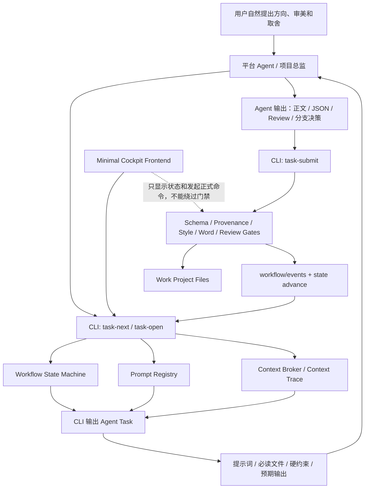

# Phase 84-90：CLI 中介 Agent 工作流内核与工程硬化计划

状态：active / partially implemented
下一阶段主目标：CLI-mediated Agent Workflow Kernel  
适用仓库：`literary-engineering-project-skill` 开发版  
目标读者：维护本 Skill 的平台 Agent、项目开发者、后续代码实现者  
生成背景：基于当前 Skill 架构复盘，以及对 ProseForge、ai-novel-writer、AI-Novel-Writing-Assistant 三个外部项目的互补性分析。

执行记录：`v0.84.0` 已完成 Phase 84 的 `scene-development` 最小 CLI 中介闭环；`v0.84.1` 已把 `task-complete` 接入按 `current_state` 的真实门禁校验；`v0.84.2` 已把 task registry 插件化为 route registry，并将 `longform-planning` 接入同一套任务循环；`v0.84.3` 已将 `source-ingest` 接入任务循环；`v0.84.4` 已将 `style-engineering` 接入任务循环；`v0.84.5` 已将 `character-and-world-assets` 接入任务循环；`v0.84.6` 已将 `review-and-audit` 与 `export-and-release` 接入任务循环，详见 `docs/implementation/phase84-cli-mediated-agent-workflow.md`。Phase 85-90 仍按本计划继续推进。

## 1. 背景与判断

当前 Skill 的核心定位已经从“本地大模型创作应用”转向“供 Codex、Claude 等工具层平台使用的大型项目型 Skill”。这意味着创作总监、LLM provider、子 agent 编排和自由对话能力主要由宿主平台承担；本仓库负责提供工程化工作区、Artifact Contract、正式路线 CLI、agent task sidecar、审查门禁、文风挂载、字数预算、导出封装和可审计的项目状态。

外部项目调研后形成的判断如下：

| 项目 | 可吸收优势 | 对本 Skill 的意义 | 注意事项 |
| --- | --- | --- | --- |
| ProseForge | Docker/Web/API、PostgreSQL/Redis/Celery、任务队列、版本管理、备份恢复、异步工作流 | 提供“工程运行时”和“长任务调度”的参考 | 不复制 AGPL 代码，只吸收架构思想并重新实现 |
| ai-novel-writer | 低门槛模块化写作流程、本地模型设置、项目导入导出、TXT/ZIP 打包 | 提供“轻量用户体验”和“一键化使用路径”的参考 | MIT 项目可参考实现思路，但仍优先保持本仓库文件契约 |
| AI-Novel-Writing-Assistant | Creative Hub、LangGraph Agent Runtime、Prompt Registry、Context Broker/RAG、风格引擎、读者体验契约 | 提供“产品级协同写作平台”和“agent workflow 编排”的参考 | 不复制 AGPL 代码，重点吸收概念并改造成 Skill-first 机制 |

本 Skill 不应简单变成另一个前后端应用。更合适的方向是：继续强化“把 AI 关在程序里”的能力，让平台 Agent 自由创作，但所有正式创作、推演、审查、晋升、导出都被文件契约、状态机、门禁、侧车任务和可追踪上下文约束住。

本次规划进一步确认下一阶段主线：把平台 Agent 的正式项目操作对象，从“用户要求 + 文档提醒 + 分散 CLI 命令”，升级为“CLI 持续状态机”。用户继续与平台 Agent 自然对话；但任何会进入 `canon/`、`characters/`、`plot/`、`scenes/`、`drafts/`、`reviews/`、`exports/` 的正式产物，都必须由 CLI 发任务、输出给 Agent 的提示词、接收 Agent 提交、校验门禁、落实到文件并推进状态。

## 2. 总目标

Phase 84-90 的目标是把当前 Skill 从“已经具备完整路线的工程型工具包”，推进到“可长期运行、可审计、难跳步、适合长篇生产的 Skill 内核”。其中首要目标是建立 CLI-mediated Agent Workflow Kernel：非正式讨论保持自然自由，正式项目产物统一由 CLI 持续状态机中介。

具体目标：

1. 建立 CLI 中介的任务循环：`task-next` 发任务，`task-open` 展开提示词和上下文，`task-submit` 接收 Agent 输出，`task-complete` 写 completion marker，`workflow-advance` 推进状态。
2. 将外部项目调研沉淀为仓库内正式设计资产，但只作为架构支撑，不抢占下一阶段主目标。
3. 建立文件型 Prompt Registry，让所有生成、审查、修订、提取任务的提示词有编号、版本、适用范围和输出契约，并由 CLI 输出给平台 Agent。
4. 建立 Context Broker 与 Context Trace，让每一次创作都能说明读了什么、压缩了什么、丢弃了什么、依据来自哪里。
5. 建立持续工作流状态机，让场景路线、章节路线、长篇路线不再只依赖 agent 自觉。
6. 建立 Reader Experience Contract 和 Chapter Obligation Contract，让剧情推进不只满足 canon，还要满足读者悬念、承诺兑现、节奏和章节功能。
7. 建立最小项目总控面板，让用户和维护者能看到项目状态、缺口、门禁和配置，但不让前端绕过 Skill 正式路线。
8. 建立失败模式回归测试，专门防止跳过 RP、跳过 review、跳过 word budget、导出泄漏工程痕迹、subagent 代写正文等历史问题复发。

## 3. 非目标

本阶段不做以下事情：

1. 不直接复制 ProseForge 或 AI-Novel-Writing-Assistant 的代码、文档、prompt 或 UI 文案。
2. 不把本 Skill 改造成依赖固定 HTTP LLM provider 才能运行的应用。
3. 不让本地 `director-chat` 重新成为主创作路径。它仍保持 legacy/debug 定位。
4. 不降低平台 Agent 的创作自由度。约束的是正式产物链路，不是用户与 Agent 的自然讨论。
5. 不新增可绕过 review、promotion、route-audit 的快捷命令。
6. 不让前端成为创作状态的第二套真相。工作项目文件仍是唯一 source of truth。
7. 不把字数不足问题交给“拉长句子”解决。必须从剧情库存、章节义务和场景预算解决。
8. 不要求用户直接和 CLI 对话。用户的主要体验仍是和平台 Agent 沟通创作方向、审美判断和重大取舍。
9. 不让 CLI 代替平台 Agent 做创作判断。CLI 是任务、状态、校验和落盘中介，不是小说作者、审稿人或项目总监。

## 4. 设计原则

### 4.1 Skill-first

所有能力优先以 Skill 文件、模板、schema、CLI sidecar 和 agent task 方式实现。前端、LangGraph、Dify、外部服务只能调用或呈现这些机制，不能替代它们。

### 4.2 平台 Agent 主导

创意判断、正文写作、文风学习总结、角色心理推演、分支选择、审查结论、JSON 草案修复、项目取舍必须由加载 Skill 的平台 Agent 执行。本地脚本负责生成任务、校验结构、统计事实、检查门禁、输出证据。

### 4.3 CLI provenance 必须可见

正式路线产物必须记录由哪个 CLI 命令生成、输入来源是什么、对应 sidecar 是否完成、expected artifact 是否存在。手写文件不能冒充正式 CLI 产物。

### 4.4 所有非确定性任务都要显式 sidecar

凡是需要 Agent 判断的步骤，都必须写出 `.agent_tasks.md`，并在任务完成后写出相邻 `.agent_completion.json`。任务不能藏在长文档内部，也不能只在终端里提示。

### 4.5 上下文可追踪

每次生成或审查都要能追踪上下文来源：读了哪些角色文件、哪些 canon、哪个 Style Skill、哪个 word budget、哪个 branch selection、哪个上一场尾部、哪些内容被摘要或故意排除。

### 4.6 读者体验进入硬约束

长篇不是场景堆叠。每章、每场必须说明读者问题、承诺兑现、悬念延续、情绪节奏、人物净变化、信息释放和章节义务。否则即使 canon 正确，也不应进入正式生成。

### 4.7 用户自然对话，正式产物 CLI-mediated

用户与平台 Agent 的讨论、头脑风暴、审美判断和大方向选择可以自然进行，不强制每句话进入 CLI。凡是会被推广、计数、导出、写回或作为正式项目依据的产物，必须经过 CLI 任务发放、Agent 输出提交、确定性校验和状态推进。

### 4.8 CLI 是门禁中介，不是创作权威

CLI 可以告诉 Agent 下一步是什么、必须读什么、使用哪份 Prompt Asset、输出到哪里、哪些门禁不能跳过。CLI 不能替 Agent 判断人物是否合理、分支是否精彩、正文是否有文学完成度。它负责把 Agent 的自由能力落进可审计工程流程。

## 5. 总体架构方向



## 6. Phase 84：CLI-mediated Agent Workflow Kernel

### 6.1 目标

建立正式项目操作的最小 CLI 中介闭环。平台 Agent 不再直接把“写文件”当作正式完成，而是先向 CLI 询问下一任务，读取 CLI 输出的任务说明、提示词、上下文、硬约束和预期产物，然后把自己的输出提交回 CLI，由 CLI 完成校验、落盘、completion marker 和状态推进。

一句话原则：Informal chat is free. Formal artifacts are CLI-mediated.

### 6.2 计划新增或更新文件

1. `src/literary_engineering_workbench/task_registry.py`
2. `src/literary_engineering_workbench/task_submit.py`
3. `schemas/agent_task.v1.json`
4. `schemas/agent_submission.v1.json`
5. `schemas/agent_completion.v1.json`
6. `templates/work-project/workflow/tasks/.gitkeep`
7. `docs/modules/cli-mediated-agent-workflow.md`
8. `references/cli-run-protocol.md` 增强：明确正式项目操作必须走 `task-next` / `task-submit`。
9. `AGENTS.md`、`SKILL.md` 增强：明确手写正式产物不能绕过 CLI task registry。

### 6.3 计划新增或增强 CLI

1. `task-next`：根据项目状态、route、scene/chapter/work target 输出下一项正式任务。
2. `task-open`：展开某个 task 的完整执行包，包括 Prompt Asset、必读文件、context trace、硬约束、输出契约和 forbidden shortcuts。
3. `task-submit`：接收平台 Agent 写出的正文、JSON、Markdown、review、branch selection、state patch 等候选输出。
4. `task-complete`：在 expected artifacts、schema、lint、provenance、review gate 通过后写入 `.agent_completion.json`。
5. `workflow-state`：显示当前 project、chapter、scene 的正式状态。
6. `workflow-advance`：只允许合法状态跃迁，拒绝跳过 RP、branch、compose、review、promote、state-evolve。
7. `workflow-events`：以 JSONL 记录 task issued、task opened、submission received、validation passed/failed、state advanced、gate blocked。

### 6.4 任务生命周期

正式 Agent 任务的生命周期：

1. `planned`：CLI 根据 route 和项目状态识别待办。
2. `issued`：CLI 写出 `workflow/tasks/{task_id}.task.json` 和 `.agent_task.md`。
3. `opened`：Agent 通过 `task-open` 读取任务，CLI 记录 reading/open event。
4. `submitted`：Agent 通过 `task-submit` 提交输出路径或正文片段。
5. `validated`：CLI 执行 schema、style lint、word target、context trace、provenance、route gate。
6. `completed`：CLI 写出 `.agent_completion.json`，任务才算完成。
7. `advanced`：状态机进入下一合法状态。
8. `blocked`：若校验失败，CLI 写出阻塞原因和下一步修复任务。

### 6.5 Agent Task 必备信息

每个正式 task 必须包含：

1. `task_id`
2. `route`
3. `current_state`
4. `next_allowed_states`
5. `prompt_asset_id`
6. `required_reading`
7. `context_trace`
8. `hard_constraints`
9. `style_constraints`
10. `word_count_target` / `word_count_min` / `word_count_max`，当适用时必填。
11. `expected_outputs`
12. `submission_command`
13. `validation_gates`
14. `forbidden_shortcuts`

### 6.6 第一条样板路线

先以 `scene-development` 为样板，不立即重构所有路线。

样板链路：

```text
task-next
  -> context task
  -> roleplay task
  -> branch task
  -> branch-selection task
  -> composition task
  -> prose-generation task
  -> agent-review task
  -> revision task when needed
  -> promotion task
  -> state-evolve task
  -> chapter/export readiness task
```

每一步都由 CLI 发任务，每一步都要求 Agent 提交输出，每一步都留下 event 和 completion marker。

### 6.7 强制约束

1. 任何正式产物不能仅凭文件存在进入下一状态。
2. 任何 `.agent_tasks.md` 不能内嵌藏在正文文件里，必须注册到 `workflow/tasks/`。
3. 任何手写同名文件如果没有 task provenance，只能算 exploratory artifact。
4. `route-audit` 必须检查 task registry，而不是只检查旧路径文件是否存在。
5. `promote-candidate`、`chapter-workspace`、`export-package` 必须拒绝缺少 task submission / completion 的正式产物。
6. CLI 输出给 Agent 的提示词必须来自 Prompt Registry，而不是散落在代码和文档里的隐式说明。
7. CLI 接收 Agent 输出后只能执行确定性校验和落盘；不能把本地模型、dry-run 或 HTTP provider 结果当作正式创作权威。

### 6.8 外部项目吸收记录（支撑任务）

把三类外部项目的互补点、不可采纳点、许可证风险和可重新实现机制写入正式研究文档，避免后续开发只靠对话记忆。该任务服务于 CLI-mediated kernel，不作为 Phase 84 的主线目标。

计划新增或更新文件：

1. `docs/research/external-novel-systems-review.md`
2. `docs/architecture/external-ideas-adoption-map.md`
3. 必要时在 `README.md` 或 `docs/roadmap.md` 中增加链接，不展开长篇内容。

关键内容：

1. 记录三个外部项目的仓库地址、检视时间和远程 HEAD：
   - ProseForge：`f40897317a1aec654b539128c77529851a31cac8`
   - ai-novel-writer：`7626cd7601bbff99a52ea5913d505568b589069a`
   - AI-Novel-Writing-Assistant：`4f4def1d5dfbcbc168b026723023fd00e497b247`
2. 按“功能、工程实现、用户体验、agent 编排、数据模型、许可风险”六个维度比较。
3. 输出“可吸收机制”和“明确不采纳机制”。
4. 对 AGPL 项目标注“架构借鉴，不复制代码”。

### 6.9 验收标准

1. `task-next` 能对至少一个 demo scene 输出下一步正式任务。`v0.84.0` 已完成。
2. `task-open` 能输出 Agent 可直接执行的提示词包，而不是只给路径。`v0.84.0` 已完成。
3. `task-submit` 能接收 Agent 输出并写入 submission 记录。`v0.84.0` 已完成。
4. `task-complete` 能在 expected artifacts 缺失时拒绝完成。`v0.84.0` 已完成。
5. `task-complete` 能按 `current_state` 调用真实门禁，拒绝手写 composition、缺 generation provenance、Style Lint blocking、word-budget sidecar/review 未完成、`pass_with_notes` AgentReview、debug-waiver promotion、非 clean pass static review 和损坏 state patch JSON。`v0.84.1` 已完成。
6. `workflow-state` 能显示 scene 当前状态和下一合法状态。已由 Phase 83 提供，`v0.84.0` 已接入 task loop。
7. `route-audit --route scene-development` 能基于 task registry 阻塞手写绕过产物。部分完成：当前已扫描 `workflow/tasks/*.agent_tasks.md` 的 pending/completion；更强 task provenance gate 留给 Phase 87/90。
8. 外部项目研究文档完成，且没有引入外部受限源码或 prompt。待完成。
9. `longform-planning` 能通过 `task-next` 派发预算 scaffold、预算 Agent task、预算 review、场景库存 Agent task 和库存 review。`v0.84.2` 已完成。
10. `task-complete` 能拒绝 longform 的 `pass_with_notes` review、缺失预算化大纲候选、缺失分场景库存候选或缺失 sidecar completion marker。`v0.84.2` 已完成。
11. `source-ingest` 能通过 `task-next` 派发已有作品反推任务，要求候选项目文件、source extraction completion marker 和 clean review。`v0.84.3` 已完成。
12. `task-complete` 能拒绝 source-ingest 的缺失候选输出、缺失 completion marker 或 `pass_with_notes` extraction review。`v0.84.3` 已完成。
13. `style-engineering` 能通过 `task-next` 派发项目内 style profile 的 prompt sidecar、prompt execution、prompt quality 和 eval readiness 任务。`v0.84.4` 已完成。
14. `task-complete` 能拒绝 style prompt 过短/缺结构、缺 completion marker 或缺 accepted style eval。`v0.84.4` 已完成。
15. `character-and-world-assets` 能通过 `task-next` 派发资产 intake、创建 sidecar、候选审查、clean pass、用户 approval 和 promotion 任务。`v0.84.5` 已完成。
16. `task-complete` 与 `route-audit` 能拒绝缺候选 JSON/报告、缺 sidecar completion、缺 review、缺用户 approval、使用 `--allow-unapproved` 或 promotion 输出缺失的角色/世界资产。`v0.84.5` 已完成。
17. `review-and-audit` 能通过 `task-next` 派发 canon-lint、canon review、longform audit、committee review，并拒绝 warnings、unresolved facts、timeline risks、action_items 或 disagreements 未清零的项目级审查。`v0.84.6` 已完成。
18. `export-and-release` 能通过 `task-next` 派发 chapter-workspace、export-package、release approval、publish-release，并拒绝 `include_blocked`、缺 approval、latest 指针错误、发布输出缺失和读者正文工程痕迹泄漏。`v0.84.6` 已完成。

### 6.10 横向接入优先级

Phase 84 后续横向接入顺序：

1. `source-ingest`：让已有作品导入、反推设定、证据 review 和候选项目文件生成进入 task loop。`v0.84.3` 已完成导入后的反推闭环。
2. `style-engineering`：让作家项目、作品导入、文风 profile、LLM-facing prompt、style eval、Style Skill build/mount 进入 task loop。`v0.84.4` 已完成项目内 profile 到 prompt/eval readiness 的闭环；作家库跨项目任务可继续增强。
3. `character-and-world-assets`：让角色/世界候选、asset review、approval、promotion 进入 task loop。`v0.84.5` 已完成。
4. `review-and-audit`：让 canon/style/route/longform/chapter 审计作为正式修复任务输出。`v0.84.6` 已完成项目级 canon/longform/committee 闭环。
5. `export-and-release`：让 chapter workspace、export package、publish gate 和 release approval 进入 task loop。`v0.84.6` 已完成章节导出/发布闭环；DOCX layout/inspection 继续由 export package 与 file-format-export 门禁覆盖。

横向接入的共同验收口径：所有路线都必须由 route registry 选择当前步骤、输出统一 task package、要求平台 Agent 提交产物、由 `task-complete` 执行路线专属 gate，并在 `workflow-state` 中显示 ready/blocked。

## 7. Phase 85：文件型 Prompt Registry

### 7.1 目标

把散落在模板、代码和文档里的提示词升级为可注册、可版本化、可审计的 Prompt Asset。它不是让本地 CLI 调 LLM，而是让平台 Agent 明确知道当前任务该使用哪份提示词约束、哪些上下文槽位、输出什么 artifact。

### 7.2 计划新增文件

1. `schemas/prompt_asset.v1.json`
2. `templates/prompt_assets/scene.compose.v1.md`
3. `templates/prompt_assets/scene.prose_generation.v1.md`
4. `templates/prompt_assets/scene.agent_review.v1.md`
5. `templates/prompt_assets/scene.revision.v1.md`
6. `templates/prompt_assets/style.compile_prompt.v1.md`
7. `templates/prompt_assets/source.reverse_extract.v1.md`
8. `templates/prompt_assets/state.evolve.v1.md`
9. `docs/modules/prompt-registry.md`

### 7.3 计划新增 CLI

1. `prompt-registry-list`
2. `prompt-registry-validate`
3. `prompt-preview`

### 7.4 Prompt Asset 必备字段

1. `prompt_asset_id`
2. `version`
3. `route`
4. `task_type`
5. `required_inputs`
6. `optional_inputs`
7. `context_groups`
8. `hard_constraints`
9. `style_constraints`
10. `output_contract`
11. `review_requirements`
12. `forbidden_shortcuts`

### 7.5 链路接入点

1. `compose-scene --agent-tasks` 的 sidecar 必须引用 composition prompt asset。
2. `generate-scene` 或正文生成任务必须引用 prose generation prompt asset。
3. `agent-review-scene` 必须引用 review prompt asset，并注入确定性 Style Lint 结果。
4. `revise-scene` 必须引用 revision prompt asset，并强制 anti-evasion burden-of-proof。
5. `compile-style` 与 Style Skill 打包必须引用 style prompt asset。

### 7.6 验收标准

1. 所有正式 agent task 都带 `prompt_asset_id`、版本和输出契约。
2. `prompt-registry-validate` 能检查缺字段、非法上下文槽位、无输出契约等问题。
3. 不再依赖“读者自己知道该怎么写”的隐式约束。

## 8. Phase 86：Context Broker 与 Context Trace

### 8.1 目标

解决“Agent 不知道该读什么、读太多、漏读文风或字数预算、上下文不可复盘”的问题。Context Broker 不替 Agent 判断，只负责把正式路线需要的上下文打包并留下 trace。

### 8.2 计划新增或更新文件

1. `src/literary_engineering_workbench/context_broker.py`
2. `schemas/context_trace.v1.json`
3. `templates/work-project/workflow/context_traces/.gitkeep`
4. `docs/modules/context-broker.md`

### 8.3 Context Trace 必备字段

1. `scene_id`
2. `route`
3. `created_at`
4. `required_context_groups`
5. `loaded_files`
6. `summarized_files`
7. `excluded_files`
8. `style_mounts`
9. `word_budget_source`
10. `character_files`
11. `canon_files`
12. `previous_scene_tail`
13. `token_or_length_budget`
14. `missing_required_context`

### 8.4 接入点

1. `context` 命令输出 context packet 时同时输出 `context_trace.v1.json`。
2. `compose-scene` 必须读取 context trace，并把 trace 路径写入 composition manifest。
3. `agent-review-scene` 必须比较 draft 与 context trace，检查是否漏掉 style、word budget、canon 或角色背景。
4. `route-audit` 必须把缺失 context trace 作为 blocking gate。

### 8.5 验收标准

1. 每个正式场景都有 context packet 和 context trace。
2. Agent 可以通过 trace 快速知道“这次写作到底读了什么”。
3. 缺失 Style Skill、word budget 或关键角色文件时，route-audit 阻塞。

## 9. Phase 87：持续工作流状态机

### 9.1 目标

把 scene-development、longform-planning、export-release 变成显式状态机，减少 Agent 因速度优化跳过流程的空间。

### 9.2 计划新增或更新文件

1. `src/literary_engineering_workbench/workflow_state.py`
2. `schemas/workflow_state.v1.json`
3. `schemas/workflow_event.v1.json`
4. `templates/work-project/workflow/state.json`
5. `docs/modules/workflow-state-machine.md`

### 9.3 计划新增 CLI

1. `workflow-state`
2. `workflow-advance`
3. `workflow-events`
4. `route-audit` 增强：读取状态机并报告非法跃迁。

### 9.4 场景路线状态

建议初始状态：

1. `scene_registered`
2. `context_ready`
3. `roleplay_tasks_ready`
4. `roleplay_completed`
5. `branch_manifest_ready`
6. `branch_selection_completed`
7. `composition_ready`
8. `prose_candidate_ready`
9. `agent_review_completed`
10. `revision_required`
11. `revision_completed`
12. `promoted`
13. `state_patch_ready`
14. `state_patch_applied`
15. `chapter_ready`
16. `export_ready`

### 9.5 状态跃迁规则

1. 不能从 `context_ready` 直接进入 `prose_candidate_ready`。
2. `branch_selection_completed` 之前不能 compose。
3. `composition_ready` 之前不能正式生成正文。
4. `agent_review_completed` 必须引用 exact candidate。
5. `pass_with_notes` 只能进入 `revision_required`，不能进入 `promoted`。
6. `promoted` 之前必须满足 Style Lint Gate、word target gate、style adherence gate。
7. 缺少 `.agent_completion.json` 时不能推进下一状态。

### 9.6 验收标准

1. `route-audit --route scene-development` 能报告每个场景的当前状态和下一步。
2. 使用 debug/bypass flag 无法把 formal work project 标记为完成。
3. Agent 手写关键文件但缺 CLI provenance 时，状态机不承认完成。

## 10. Phase 88：Reader Experience 与 Chapter Obligation Contract

### 10.1 目标

解决长篇写作中“每场都对，但整体不好看”“字数够了但剧情没推进”“章节没有承诺兑现”的问题。该阶段把读者体验、章节义务和剧情库存变成正式约束。

### 10.2 计划新增文件

1. `schemas/reader_experience_contract.v1.json`
2. `schemas/chapter_obligation_contract.v1.json`
3. `templates/work-project/plot/chapter_obligations/.gitkeep`
4. `docs/modules/reader-experience-contract.md`

### 10.3 Reader Experience 字段

1. `reader_question`
2. `promised_reward`
3. `withheld_information`
4. `payoff_or_delay`
5. `emotional_curve`
6. `tension_source`
7. `curiosity_hook`
8. `freshness_requirement`
9. `anti-summary_requirement`
10. `reader_aftertaste`

### 10.4 Chapter Obligation 字段

1. `chapter_id`
2. `target_word_count`
3. `scene_count_target`
4. `chapter_function`
5. `must_payoff`
6. `must_setup`
7. `must_change`
8. `must_not_resolve`
9. `inherited_hooks`
10. `ending_hook`
11. `inventory_sufficiency`
12. `expansion_needed`

### 10.5 链路接入

1. `word-budget` 输出章节和场景预算后，生成 chapter obligation agent task。
2. `compose-scene` 必须读取当前章节义务。
3. `scene.yaml` 必须携带 `word_count_target`、`word_count_min`、`word_count_max`、`chapter_obligation_id`。
4. 正文生成任务必须把字数目标作为硬属性，而不是软建议。
5. `agent-review-scene` 必须检查场景正文是否满足场景功能、字数范围、读者问题和承诺推进。
6. `longform-audit` 必须检查章节义务是否被兑现，不能只统计文件存在。

### 10.6 验收标准

1. 长篇项目生成前必须能看到“剧情库存是否足以支撑目标字数”。
2. 每个正式场景都带目标字数范围和章节义务引用。
3. 正文字数统计只统计 cleaned deliverable prose，不统计工程痕迹。
4. 欠账场景和欠账章节能被自动列出。

## 11. Phase 89：最小项目总控面板

### 11.1 目标

提供一个轻量 cockpit，让用户和维护者查看项目健康度、配置、缺失 sidecar、字数预算、文风挂载、导出状态和路由门禁。它服务于 Skill，不取代 Skill。

### 11.2 功能范围

1. 全局配置查看和安全编辑。
2. 当前项目读取，不展示裸露内部 JSON 作为主要体验。
3. route-audit 面板。
4. agent-task-status 面板。
5. word budget 和 scene inventory 面板。
6. Style Skill 挂载状态。
7. scene loop 状态机视图。
8. export readiness 面板。
9. 命令预览和安全执行入口。

### 11.3 明确限制

1. 前端不能直接写 promoted drafts。
2. 前端不能绕过 AgentReview。
3. 前端不能存真实 API key 到项目文件。
4. 前端不能把 hidden background story 泄漏到最终导出。
5. 前端不能把 debug/bypass flag 暴露给普通 Skill 使用路径。

### 11.4 验收标准

1. 用户能一眼看到“下一步该做什么”。
2. 维护者能看到每个 scene 卡在哪个 gate。
3. 任何前端触发的正式动作仍经过 CLI provenance 和 sidecar completion。

## 12. Phase 90：失败模式回归测试

### 12.1 目标

把过去暴露出来的真实失败方式写成测试，防止后续优化把门禁弄松。

### 12.2 必测失败模式

1. `simulate-scene --agent` 输出后未完成 sidecar，`branch-simulate` 或 `compose-scene` 应阻塞。
2. 有 branch manifest 但无 `branch_selection.md`，不能 compose。
3. 手写 composition 缺 CLI provenance，不能生成正式正文。
4. 正文 candidate 没有 exact-candidate AgentReview，不能 promote。
5. AgentReview 为 `pass_with_notes`，不能 promote，必须进入 revise-scene。
6. `不是……而是……`、`不是……——是……` 和同功能伪装转折触发 Style Lint blocking。
7. revision 用另一种转折替换 banned contrast，anti-evasion gate 阻塞。
8. scene YAML 缺 `word_count_target`，长篇正式生成阻塞。
9. 章节导出包含 `scene_0001`、canon notes、review text、writeback candidate，export gate 阻塞。
10. subagent 被记录为正文作者，route-audit 阻塞。
11. debug/bypass flag 在 formal Skill-host 模式下被使用，审计报告标记为 invalid。

### 12.3 验收标准

1. 测试覆盖 CLI 门禁、schema、style lint、export cleanup、word budget、state machine。
2. 每个历史故障至少有一个 regression fixture。
3. `python -m unittest discover -s tests -v` 通过。

## 13. 建议实施顺序

优先级从高到低：

1. Phase 84 CLI-mediated Agent Workflow Kernel：先做 `task-next` / `task-open` / `task-submit` / `task-complete` 的最小闭环，让正式项目操作有统一入口。
2. Phase 85 Prompt Registry：把 CLI 输出给 Agent 的提示词、硬约束和输出契约注册化，避免 task 继续依赖散落文档。
3. Phase 86 Context Broker：让 CLI task 能稳定携带必读上下文、context trace、文风、字数预算和角色背景。
4. Phase 87 Workflow State Machine：把 Phase 84 的最小任务闭环扩展为完整 scene/chapter/longform 状态机。
5. Phase 88 Reader Experience Contract：强化长篇剧情质量和字数承载，并接入 task-open / task-submit / review gate。
6. Phase 90 Regression Tests：把门禁和历史问题固化，尤其测试“Agent 不经 CLI 手写正式产物”的失败模式。
7. Phase 89 Minimal Cockpit：等 task registry、状态机和 audit 输出稳定后再做面板，否则前端会跟着内部接口反复改。
8. 外部项目 Research Docs 可以穿插完成，但必须在引入外部架构概念前先落文档。

## 14. 验证计划

每个 phase 完成后至少运行：

```powershell
$env:PYTHONPATH = "src"
python -m literary_engineering_workbench --help
python -m unittest discover -s tests -v
```

涉及正式路线时追加：

```powershell
$env:PYTHONPATH = "src"
python -m literary_engineering_workbench protocol scene-development
python -m literary_engineering_workbench task-next --project <work-project> --route scene-development
python -m literary_engineering_workbench task-open --project <work-project> --task-id <task-id>
python -m literary_engineering_workbench task-submit --project <work-project> --task-id <task-id> --from <artifact>
python -m literary_engineering_workbench agent-task-status --project <work-project>
python -m literary_engineering_workbench route-audit --project <work-project> --route scene-development
```

涉及 Prompt Registry 时追加：

```powershell
$env:PYTHONPATH = "src"
python -m literary_engineering_workbench prompt-registry-validate
```

涉及导出时追加：

```powershell
$env:PYTHONPATH = "src"
python -m literary_engineering_workbench export-package --project <work-project> --format docx
```

导出验证必须确认最终作品不含 scene 编号、canon notes、review notes、workflow traces、agent task、writeback candidate、内部路径等工程痕迹。

## 15. 风险与缓解

| 风险 | 表现 | 缓解 |
| --- | --- | --- |
| 过度工程化 | Agent 被流程拖慢，用户体验下降 | cockpit 只显示下一步和关键阻塞；非正式讨论允许跳过 CLI |
| CLI 成为新瓶颈 | 每次创作都要跑太多命令 | 只要求 formal artifacts 走 CLI；探索性讨论和用户自然对话不进入 task registry |
| CLI 被误解为创作权威 | 维护者把 task 输出当成正文判断 | 文档和 schema 明确 CLI 只发任务、验结构、管状态，不写正文、不替代审稿 |
| Prompt Registry 变僵硬 | 写作自由度被模板压扁 | registry 管约束和输出契约，不替代平台 Agent 创作判断 |
| Context Trace 太重 | 每场上下文文件过多 | trace 存文件，task 中只注入摘要和必要路径 |
| 状态机误伤探索工作 | 草稿讨论也被正式路线卡住 | 区分 exploratory 与 formal route，只有可推广、计数、导出的产物走硬门禁 |
| 前端绕过流程 | 用户点按钮生成未审查内容 | 前端只调用正式 CLI，且 route-audit 作为导出前强制检查 |
| 外部项目许可证风险 | 不慎复制受限代码 | 文档记录“架构借鉴，重新实现”，代码评审检查来源 |

## 16. 预期完成态

Phase 84-90 完成后，本 Skill 应具备以下能力：

1. 平台 Agent 在自由对话中接管项目，但正式产物不会脱离工程路线。
2. 正式项目操作统一由 CLI 任务状态机中介：CLI 发任务，Agent 执行，CLI 收提交、校验、落盘、推进状态。
3. 每个 agent task 都有明确 prompt asset、输入来源、输出契约和 completion marker。
4. 每次生成都能追踪上下文来源，尤其是文风、字数预算、角色背景、canon 和前文尾部。
5. 场景、章节、长篇导出都有持续状态机和 route-audit 约束。
6. 字数目标从规划进入 scene YAML、compose、generate、review、longform-audit、export，不再是孤立预算文件。
7. 读者体验、章节承诺和剧情库存成为正式审查对象。
8. 前端成为项目总控面板，而不是第二套创作系统。
9. 历史上最容易被 Agent 跳过的流程都有回归测试和阻塞门禁。

## 17. 下一步建议

建议从 Phase 84 开始实现 CLI-mediated Agent Workflow Kernel。第一步不要一次性重构所有路线，而是先在 `scene-development` 上打通最小闭环：`task-next` 生成下一步、`task-open` 给出 Agent 可执行提示词包、平台 Agent 写出产物、`task-submit` 接收提交、`task-complete` 校验并推进状态。该闭环稳定后，再进入 Phase 85，把 task 输出统一接入 Prompt Registry。
